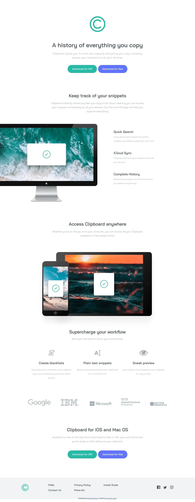

# Frontend Mentor - Clipboard landing page solution

This is a solution to the [Clipboard landing page challenge on Frontend Mentor](https://www.frontendmentor.io/challenges/clipboard-landing-page-5cc9bccd6c4c91111378ecb9). Frontend Mentor challenges help you improve your coding skills by building realistic projects. 

## Table of contents

- [Overview](#overview)
  - [The challenge](#the-challenge)
  - [Screenshot](#screenshot)
  - [Links](#links)
- [My process](#my-process)
  - [Built with](#built-with)
- [Author](#author)

## Overview

### The challenge

Users should be able to:

- View the optimal layout for the site depending on their device's screen size
- See hover states for all interactive elements on the page

### Screenshot

### Links

- Solution URL: [github](https://github.com/julabina/FRONTEND_MENTOR/tree/master/junior/Clipboard_landing_page_challenge_hub)
- Live Site URL: [github page](https://julabina.github.io/FRONTEND_MENTOR/junior/Clipboard_landing_page_challenge_hub/index.html)

## My process

### Built with

- Semantic HTML5 markup
- CSS custom properties
- Sass
- Flexbox

## Author

- Website - [Github](https://github.com/julabina)
- Frontend Mentor - [@julabina](https://www.frontendmentor.io/profile/julabina)

