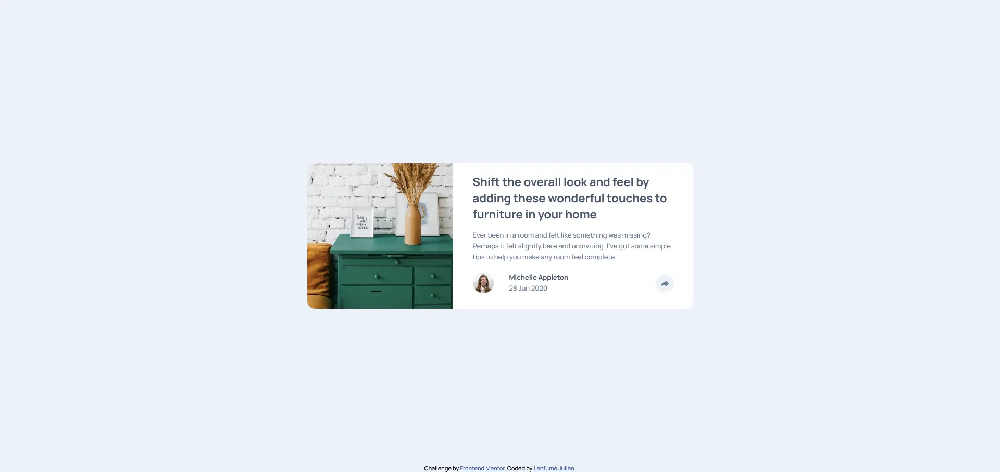

# Frontend Mentor - Article preview component solution

This is a solution to the [Article preview component challenge on Frontend Mentor](https://www.frontendmentor.io/challenges/article-preview-component-dYBN_pYFT). Frontend Mentor challenges help you improve your coding skills by building realistic projects.

## Table of contents

- [Overview](#overview)
  - [The challenge](#the-challenge)
  - [Screenshot](#screenshot)
  - [Links](#links)
- [My process](#my-process)
  - [Built with](#built-with)
  - [Continued development](#continued-development)
- [Author](#author)

**Note: Delete this note and update the table of contents based on what sections you keep.**

## Overview

### The challenge

Users should be able to:

- View the optimal layout for the component depending on their device's screen size
- See the social media share links when they click the share icon

### Screenshot

### Links

- Solution URL: [Github repository](https://github.com/julabina/FRONTEND_MENTOR/tree/master/Article_preview_component)
- Live Site URL: [Live site](https://julabina.github.io/FRONTEND_MENTOR/Article_preview_component/index.html)

## My process

### Built with

- Semantic HTML5 markup
- CSS custom properties
- Flexbox

### Continued development

Make a better "media queries"

## Author

- Frontend Mentor - [@julabina](https://www.frontendmentor.io/profile/julabina)
- [Github](https://github.com/julabina)
- [Linkedin](https://www.linkedin.com/in/julien-lenfum%C3%A9-bb2979215/)
- [Portfolio](https://julienlenfume.com/)
