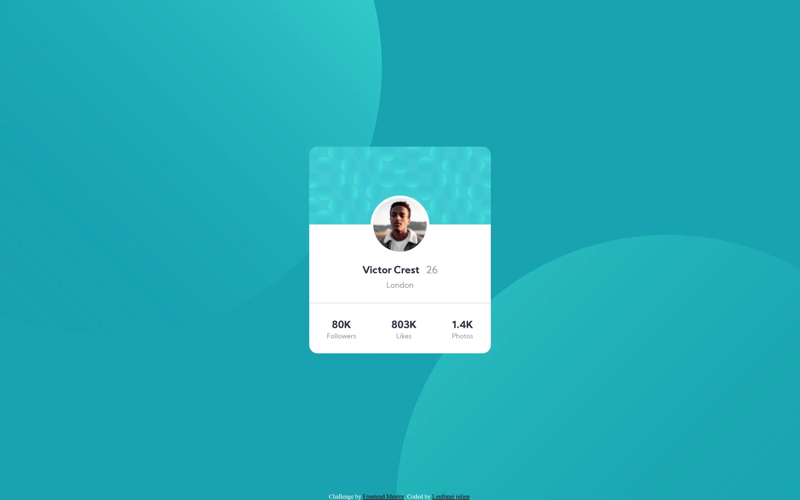

# Frontend Mentor - Profile card component solution

This is a solution to the [Profile card component challenge on Frontend Mentor](https://www.frontendmentor.io/challenges/profile-card-component-cfArpWshJ). Frontend Mentor challenges help you improve your coding skills by building realistic projects. 

## Table of contents

- [Overview](#overview)
  - [The challenge](#the-challenge)
  - [Screenshot](#screenshot)
  - [Links](#links)
- [My process](#my-process)
  - [Built with](#built-with)
  - [What I learned](#what-i-learned)
- [Author](#author)
- [Acknowledgments](#acknowledgments)

**Note: Delete this note and update the table of contents based on what sections you keep.**

## Overview

### The challenge

- Build out the project to the designs provided

### Screenshot

### Links

- Solution URL: [Github](https://github.com/julabina/fem_profil-card-component)
- Live Site URL: [Vercel Site](https://fem-profil-card-component.vercel.app/)

## My process

### Built with

- Semantic HTML5 markup
- CSS custom properties
- Flexbox

### What I learned

to use background image.

## Author

- Frontend Mentor - [@julabina](https://www.frontendmentor.io/profile/julabina)
- [Github](https://github.com/julabina)
- [Linkedin](https://www.linkedin.com/in/julien-lenfum%C3%A9-bb2979215/)
- [Portfolio](https://julienlenfume.com/)

## Acknowledgments

use background-image, background-repeat and background-position
